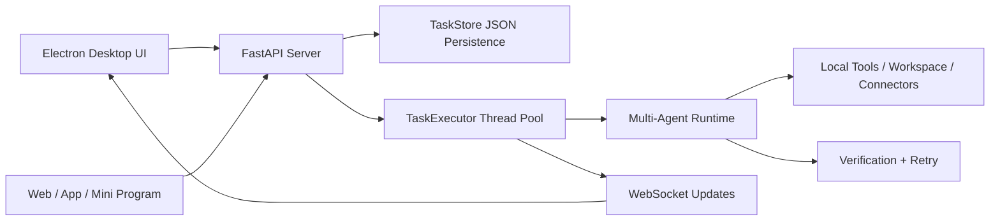

# Local Agent Workbench

[中文](#中文) | [English](#english)

[](.)
[](.)
[](.)
[](.)

---

## 中文

**一个本地优先的多 Agent 桌面工作台。**

它把“Agent 聊天脚本”变成了可观察、可接入、可异步执行的任务系统：你可以在本地桌面端选择工作区、发起任务、查看日志和结果，也可以通过标准 REST/WebSocket API 把它接到 Web、App、小程序或内部业务系统。

### 现在这个项目已经能做什么

- 在 Electron 桌面端选择本地工作区，创建异步 Agent 任务
- 支持 `manager_task`、`worker_task`、`verified_task`、`project_pipeline_task`
- 实时查看任务状态、日志、结果摘要和完整详情
- 通过 WebSocket 推送任务更新，而不是只能靠轮询
- 桌面端启动时校验后端 `project_dir`，避免误连到别的旧服务
- 后端掉线后自动探测并尝试恢复
- 重启后自动回收旧的 `pending/running` 任务，避免界面一直假装在运行
- 提供最小可落地业务接入 demo：只读 SQLite、白名单 internal API、Feishu 群通知
- 支持飞书开放平台事件订阅：群消息创建 Agent 任务，任务完成后回填原群聊
- 支持让 Elena 读取仓库变更，生成总结，并发到飞书群

### 一眼看懂

```text
本地代码仓库 / 业务 demo
    -> Agent Task API
    -> Multi-Agent Runtime
    -> 桌面端查看日志与结果
    -> 飞书群通知 / 外部系统接入
```

### 适合的使用场景

- 本地项目代码分析、审查、整理
- 私有项目资料梳理和任务分发
- 团队日报、任务播报、飞书群通知
- 给公司内部工具做一个最小 Agent 工作流底座
- 展示“Agent 如何接入真实业务系统”的工程原型

### 能力矩阵

| 模块 | 当前能力 |
|---|---|
| **桌面工作台** | 工作区选择、任务创建、任务列表、实时日志、结果面板、设置中心 |
| **任务 API** | `POST /agent/tasks` 异步创建任务，立即返回 `task_id` |
| **运行时** | Manager、Deputy、Workers、验证闭环、DAG pipeline、工具权限控制 |
| **可观测性** | 状态、进度、日志、结果预览、详情、取消任务、WebSocket 推送 |
| **启动稳定性** | Electron 校验后端身份、探活、异常恢复、旧任务回收 |
| **业务接入 demo** | `database_query`、`internal_api_request`、`git_inspect`、`feishu_send_message` |
| **飞书双向桥接** | 飞书开放平台事件订阅，群消息创建 Agent 任务，任务结束后回填原群聊 |
| **工程质量** | 模块化 `runtime/`、无 runtime -> manager 反向依赖、自动化测试覆盖 |

### 已验证的真实任务流

```text
Elena
  -> git_inspect 读取当前仓库变更
  -> 生成日报式总结
  -> feishu_send_message 推送到飞书群
```

这条链路已经在真实桌面端运行环境里验证通过，不是只在浏览器静态页面里演示。

### 架构



桌面端和外部客户端共用同一套任务 API。真正的 Agent runtime、工具权限、密钥、日志和业务 connector 都放在后端边界之后，避免把关键能力写死在 prompt 里。

### 给接入方 / Agent 的速查

- 想通过 HTTP 创建任务：从 [agent_api.md](agent_api.md) 的 `POST /agent/tasks` 开始。
- 不确定该派给谁：用 `manager_task`，只传 `description`，由 Manager 决策是否分派 Worker。
- 明确要指定成员：用 `worker_task`，同时传 `worker_name`，例如 `Alex`、`Sophia`、`Elena`。
- 要接飞书双向群聊：看 [docs/feishu_integration.md](docs/feishu_integration.md)，事件订阅 URL 是 `/integrations/feishu/events`。
- 要接数据库、内部 API 或通知工具：看 [docs/business_connectors.md](docs/business_connectors.md)，不要让 Agent 直接拼任意 SQL 或 URL。

### 快速开始

克隆并安装依赖：

```bash
git clone https://github.com/yangzhengke12-lgtm/local-agent-workbench.git
cd local-agent-workbench

python -m venv .venv
.venv\Scripts\activate

pip install -r requirements.txt
```

复制环境变量模板：

```bash
copy .env.example .env
```

打开 `.env`，只填写你实际使用的 provider。桌面端可以在没有 key 时启动，但真正的 LLM 任务至少需要一个可用 provider。

```env
ANTHROPIC_API_KEY=
ANTHROPIC_BASE_URL=
DASHSCOPE_API_KEY=
MINIMAX_API_KEY=
OPENAI_API_KEY=
OPENAI_BASE_URL=
FEISHU_WEBHOOK_URL=
FEISHU_WEBHOOK_SECRET=
FEISHU_EVENT_VERIFICATION_TOKEN=
FEISHU_EVENT_ENCRYPT_KEY=
FEISHU_APP_ID=
FEISHU_APP_SECRET=
FEISHU_DEFAULT_TASK_TYPE=manager_task
FEISHU_DEFAULT_WORKER=Elena
FEISHU_API_BASE_URL=https://open.feishu.cn/open-apis
INTERNAL_API_BASE_URL=
INTERNAL_API_TOKEN=
```

启动后端：

```bash
python server.py
```

打开：

```text
http://localhost:8000
```

启动桌面端：

```bash
cd desktop
npm install
npm start
```

Electron 会尽量自动拉起本地 FastAPI 后端。如果 8000 端口已经有服务，它会检查 `/health` 返回的 `project_dir`，确认是不是当前项目自己的后端，而不是静默误连到别的旧实例。

### API 示例

创建一个异步任务：

```bash
curl -X POST http://localhost:8000/agent/tasks ^
  -H "Content-Type: application/json" ^
  -d "{\"type\":\"worker_task\",\"worker_name\":\"Sophia\",\"description\":\"Review runtime/agent_task.py for API safety issues\"}"
```

查看状态、日志和结果：

```bash
curl http://localhost:8000/agent/tasks/<task_id>
curl http://localhost:8000/agent/tasks/<task_id>/logs
curl http://localhost:8000/agent/tasks/<task_id>/result
```

进一步说明：

- 完整 API 接入说明见 [agent_api.md](agent_api.md)
- 业务系统接入说明见 [docs/integration_guide.md](docs/integration_guide.md)
- 最小业务 connector demo 见 [docs/business_connectors.md](docs/business_connectors.md)
- 飞书开放平台双向接入完整流程见 [docs/feishu_integration.md](docs/feishu_integration.md)

### API 接口

```text
GET    /health
GET    /agent/workspace
POST   /agent/workspace
GET    /agent/workers
GET    /agent/settings
PATCH  /agent/settings
GET    /agent/runtime
GET    /integrations/feishu/status
POST   /integrations/feishu/events
POST   /agent/tasks
GET    /agent/tasks
GET    /agent/tasks/{task_id}
GET    /agent/tasks/{task_id}/detail
GET    /agent/tasks/{task_id}/logs
GET    /agent/tasks/{task_id}/result
POST   /agent/tasks/{task_id}/cancel
WS     /ws
```

任务类型：

```text
worker_task
manager_task
verified_task
project_pipeline_task
```

### 项目结构

```text
local-agent-workbench/
|-- manager.py                    # Runtime facade and CLI entry
|-- server.py                     # FastAPI backend + WebSocket + task API
|-- workers.json                  # Agent/team configuration
|-- runtime/
|   |-- agent_task.py             # Task model, store, executor
|   |-- business_connectors.py    # SQLite / internal API connector adapters
|   |-- feishu_connector.py       # Feishu/Lark webhook delivery
|   |-- feishu_inbound.py         # Feishu/Lark event parsing and idempotency
|   |-- pipeline.py               # DAG pipeline execution
|   |-- tools.py                  # Tool schemas and execution
|   |-- workers.py                # Worker execution
|   |-- verification.py           # Verification loop
|   `-- ...
|-- desktop/                      # Electron desktop workbench
|-- tests/                        # Automated tests
|-- docs/                         # Integration notes
|-- agent_api.md                  # API integration guide
`-- requirements.txt
```

### 和普通 Agent 脚本有什么不同

- 它把 Agent 暴露成服务，不是单轮聊天循环
- 它有清晰的任务生命周期：`pending`、`running`、`completed`、`failed`、`cancelled`
- 它支持后台长任务和实时状态回传
- 它的日志和结果可以从 UI 和 API 直接检查
- 它有真实的后端探活、恢复和任务持久化，不是假界面
- 它把外部系统能力放在 tool adapter 后面，而不是直接堆在 prompt 里
- 它已经包含最小业务接入 demo，可以继续替换成公司的真实数据库、内部 API、飞书机器人或知识库

### 当前安全边界

已实现：

- 任务类型白名单
- Worker 白名单来自 `workers.json`
- `description` 不能为空
- API 层不暴露任意 shell 执行入口
- runtime 工具权限按 Worker 控制
- internal API 只允许白名单路径
- SQLite demo 只允许只读查询
- Feishu webhook 由后端配置，Agent 不能直接指定任意 webhook

默认不包含：

- 公网联网搜索
- 内置 RAG / 向量数据库
- 企业 SSO / 权限系统
- 生产级数据库直连适配器
- 加密飞书事件、交互卡片、用户权限映射、Jira/GitLab 写入适配器
- 安装包或一键 exe 分发方案

### 测试

```bash
python -m pytest -q
```

桌面端 JavaScript 语法检查：

```bash
cd desktop
node --check main.js
node --check preload.js
node --check renderer.js
node --check i18n.js
```

### License

MIT

---

## English

**A local-first multi-agent desktop workbench.**

It turns a prompt-driven agent demo into an observable, async task system. You can select a local workspace from a desktop app, launch agent tasks, inspect logs and results, and expose the same runtime through REST/WebSocket APIs for web apps, internal tools, mobile clients, or mini programs.

### What Is Already Working

- Select a local workspace in the Electron desktop app and create async agent tasks
- Support `manager_task`, `worker_task`, `verified_task`, and `project_pipeline_task`
- Inspect live task status, logs, result previews, and full task details
- Push task updates over WebSocket instead of relying only on polling
- Verify backend identity through `/health` `project_dir` to avoid attaching to the wrong old service
- Detect backend loss and try to recover automatically
- Recover stale `pending/running` tasks after restart instead of leaving the UI stuck forever
- Ship minimal business integration demos for read-only SQLite, allowlisted internal APIs, and Feishu/Lark notifications
- Receive Feishu/Lark app events, create Agent tasks from group messages, and reply to the source chat
- Let Elena inspect repository changes, write a short summary, and send it to a Feishu/Lark group

### At A Glance

```text
local repository / business demo
    -> Agent Task API
    -> Multi-Agent Runtime
    -> desktop logs and result inspection
    -> Feishu/Lark notification / external system handoff
```

### Good Fit For

- Local repository analysis and review
- Private project context and task delegation
- Team status updates and Feishu/Lark notifications
- Internal tool prototypes that need a minimal agent workflow layer
- Demonstrating how agents connect to real business systems

### Capability Matrix

| Area | Current capability |
|---|---|
| **Desktop workbench** | Workspace selection, task creation, task list, live logs, result panel, settings center |
| **Task API** | `POST /agent/tasks` creates async tasks and returns `task_id` immediately |
| **Runtime** | Manager, Deputy, Workers, verification loop, DAG pipeline, tool permission control |
| **Observability** | Status, progress, logs, result preview, full detail, cancellation, WebSocket updates |
| **Startup stability** | Backend identity check, health monitoring, recovery, stale task cleanup |
| **Business connector demo** | `database_query`, `internal_api_request`, `git_inspect`, `feishu_send_message` |
| **Feishu/Lark app bridge** | Open Platform event subscriptions turn group messages into Agent tasks and reply to the source chat |
| **Engineering quality** | Modular `runtime/`, no runtime-to-manager reverse dependency, automated tests |

### Verified End-To-End Flow

```text
Elena
  -> git_inspect current repository changes
  -> write a short report-style summary
  -> feishu_send_message to a Feishu/Lark group
```

This flow has already been verified in the real desktop/runtime environment, not only in a browser mockup.

### Architecture


The desktop app and external clients share the same task API. The real runtime, tools, permissions, secrets, logs, and business connectors stay behind the backend boundary instead of being hardcoded into prompts.

### Quick Map For Integrators / Agents

- To create tasks over HTTP, start with `POST /agent/tasks` in [agent_api.md](agent_api.md).
- If you do not know which worker to pick, use `manager_task` with only `description`; the Manager decides whether to delegate.
- If you need one specific worker, use `worker_task` with `worker_name`, such as `Alex`, `Sophia`, or `Elena`.
- For bidirectional Feishu/Lark group chat, use [docs/feishu_integration.md](docs/feishu_integration.md); the event subscription URL is `/integrations/feishu/events`.
- For databases, internal APIs, or notification tools, use [docs/business_connectors.md](docs/business_connectors.md); do not let agents build arbitrary SQL or URLs.

### Quick Start

Clone the repo and install dependencies:

```bash
git clone https://github.com/yangzhengke12-lgtm/local-agent-workbench.git
cd local-agent-workbench

python -m venv .venv
.venv\Scripts\activate

pip install -r requirements.txt
```

Copy the environment template:

```bash
copy .env.example .env
```

Open `.env` and fill only the providers you actually use. The desktop app can start without keys, but real LLM tasks require at least one working provider.

```env
ANTHROPIC_API_KEY=
ANTHROPIC_BASE_URL=
DASHSCOPE_API_KEY=
MINIMAX_API_KEY=
OPENAI_API_KEY=
OPENAI_BASE_URL=
FEISHU_WEBHOOK_URL=
FEISHU_WEBHOOK_SECRET=
FEISHU_EVENT_VERIFICATION_TOKEN=
FEISHU_EVENT_ENCRYPT_KEY=
FEISHU_APP_ID=
FEISHU_APP_SECRET=
FEISHU_DEFAULT_TASK_TYPE=manager_task
FEISHU_DEFAULT_WORKER=Elena
FEISHU_API_BASE_URL=https://open.feishu.cn/open-apis
INTERNAL_API_BASE_URL=
INTERNAL_API_TOKEN=
```

Start the backend:

```bash
python server.py
```

Open:

```text
http://localhost:8000
```

Start the desktop app:

```bash
cd desktop
npm install
npm start
```

Electron tries to start the local FastAPI backend automatically. If port 8000 is already in use, it checks `/health` and verifies `project_dir` so it does not silently attach to the wrong backend from another local checkout.

### API Example

Create an async task:

```bash
curl -X POST http://localhost:8000/agent/tasks ^
  -H "Content-Type: application/json" ^
  -d "{\"type\":\"worker_task\",\"worker_name\":\"Sophia\",\"description\":\"Review runtime/agent_task.py for API safety issues\"}"
```

Inspect status, logs, and result:

```bash
curl http://localhost:8000/agent/tasks/<task_id>
curl http://localhost:8000/agent/tasks/<task_id>/logs
curl http://localhost:8000/agent/tasks/<task_id>/result
```

Further reading:

- Full API guide: [agent_api.md](agent_api.md)
- Business/system integration guide: [docs/integration_guide.md](docs/integration_guide.md)
- Minimal business connector demos: [docs/business_connectors.md](docs/business_connectors.md)
- Full Feishu/Lark Open Platform setup: [docs/feishu_integration.md](docs/feishu_integration.md)

### API Surface

```text
GET    /health
GET    /agent/workspace
POST   /agent/workspace
GET    /agent/workers
GET    /agent/settings
PATCH  /agent/settings
GET    /agent/runtime
GET    /integrations/feishu/status
POST   /integrations/feishu/events
POST   /agent/tasks
GET    /agent/tasks
GET    /agent/tasks/{task_id}
GET    /agent/tasks/{task_id}/detail
GET    /agent/tasks/{task_id}/logs
GET    /agent/tasks/{task_id}/result
POST   /agent/tasks/{task_id}/cancel
WS     /ws
```

Task types:

```text
worker_task
manager_task
verified_task
project_pipeline_task
```

### Project Structure

```text
local-agent-workbench/
|-- manager.py                    # Runtime facade and CLI entry
|-- server.py                     # FastAPI backend + WebSocket + task API
|-- workers.json                  # Agent/team configuration
|-- runtime/
|   |-- agent_task.py             # Task model, store, executor
|   |-- business_connectors.py    # SQLite / internal API connector adapters
|   |-- feishu_connector.py       # Feishu/Lark webhook delivery
|   |-- feishu_inbound.py         # Feishu/Lark event parsing and idempotency
|   |-- pipeline.py               # DAG pipeline execution
|   |-- tools.py                  # Tool schemas and execution
|   |-- workers.py                # Worker execution
|   |-- verification.py           # Verification loop
|   `-- ...
|-- desktop/                      # Electron desktop workbench
|-- tests/                        # Automated tests
|-- docs/                         # Integration notes
|-- agent_api.md                  # API integration guide
`-- requirements.txt
```

### How This Differs From A Simple Agent Script

- It exposes agents as a service, not only as a chat loop
- It has a task lifecycle: `pending`, `running`, `completed`, `failed`, `cancelled`
- It supports long-running background execution with live updates
- Logs and results are inspectable from both UI and API
- It includes real backend health monitoring, recovery, and task persistence
- External capabilities live behind tool adapters instead of being buried in prompts
- It already includes minimal business integration demos that can later be replaced by real company systems

### Current Boundaries

Implemented:

- task type allowlist
- worker allowlist from `workers.json`
- non-empty task descriptions
- no arbitrary public shell execution endpoint in the API layer
- runtime tool permissions controlled per worker
- internal API paths are allowlisted
- SQLite demo is read-only
- Feishu/Lark webhook stays backend-configured; the agent cannot inject arbitrary webhooks

Not included by default:

- public web search
- built-in RAG / vector database
- enterprise auth / SSO
- production-grade database adapters
- encrypted Feishu/Lark events, interactive cards, user permission mapping, or Jira/GitLab write adapters
- packaged installer or one-click exe distribution

### Tests

```bash
python -m pytest -q
```

Desktop JavaScript syntax checks:

```bash
cd desktop
node --check main.js
node --check preload.js
node --check renderer.js
node --check i18n.js
```

### License

MIT
