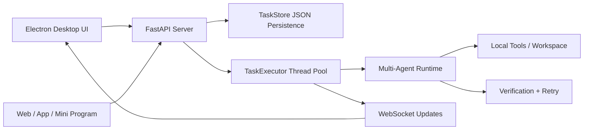

# Local Agent Workbench

**A local-first multi-agent desktop workbench for turning AI agents into observable, async task workflows.**

**本地优先的多 Agent 桌面工作台：把 Agent 从“聊天脚本”变成可观测、可接入、可异步执行的任务流服务。**

Local Agent Workbench is a FastAPI + Electron project that lets you run a multi-agent runtime from a desktop UI or a standard REST/WebSocket API. It is built for local repositories, private project context, task logs, result inspection, and controlled tool execution.

Local Agent Workbench 基于 FastAPI + Electron 构建，既可以通过桌面端操作，也可以通过标准 REST/WebSocket API 接入。它面向本地代码仓库、私有项目上下文、任务日志、结果检查和受控工具调用。

[](.)
[](.)
[](.)
[](.)

> Current scope: local project workbench. Public web search, enterprise SSO, packaged installers, and external business systems are designed as future tool/provider adapters.
>
> 当前定位：本地项目工作台。联网搜索、企业 SSO、安装包、飞书/Jira/GitLab/数据库等外部系统，适合作为后续 tool/provider adapter 接入。

## Why This Exists / 为什么做这个

Most demo agents stop at chat. This project treats agent work as a task lifecycle:

很多 Agent demo 停留在对话层；这个项目把 Agent 工作抽象成可追踪的任务生命周期：

```text
create task -> validate input -> run in background -> stream status/logs -> inspect result -> persist history
```

That makes it easier to connect agents to real product surfaces: desktop apps, internal tools, web apps, mini programs, or company workflow systems.

这样 Agent 更容易接入真实产品界面：桌面端、内部工具、Web 应用、小程序或公司业务系统。

## Highlights / 项目亮点

| Area | What is implemented |
|---|---|
| **Desktop workbench / 桌面工作台** | Electron UI with workspace selection, task list, live logs, result panel, and worker/task controls |
| **Async task service / 异步任务服务** | `POST /agent/tasks` returns immediately; `TaskExecutor` runs work in a background thread pool |
| **Observable runtime / 可观测运行时** | Task status, progress, logs, result previews, full details, cancellation, and WebSocket updates |
| **Multi-agent runtime / 多 Agent 运行时** | Manager + Deputy + 5 workers, verification loop, DAG pipeline, tool permissions, and JSON persistence |
| **Engineering hygiene / 工程化质量** | Modular `runtime/` package, no runtime-to-manager reverse dependency, 207 automated tests |

## How It Works / 架构



The desktop app and external clients use the same task API. The runtime stays behind the server boundary, so tools, keys, permissions, and logs remain controlled by the backend.

桌面端和外部客户端共用同一套任务 API。Agent Runtime 被放在服务端边界之后，工具、密钥、权限和日志都由后端统一控制。

## Quick Start / 快速启动

### 1. Install Python dependencies / 安装 Python 依赖

```bash
git clone https://github.com/yangzhengke12-lgtm/local-agent-workbench.git
cd local-agent-workbench

python -m venv .venv
.venv\Scripts\activate

pip install -r requirements.txt
```

### 2. Configure model keys / 配置模型密钥

Create `.env` in the project root:

在项目根目录创建 `.env`：

```env
ANTHROPIC_API_KEY=your-anthropic-api-key
ANTHROPIC_BASE_URL=
ANTHROPIC_MODEL=deepseek-v4-pro

OPENAI_API_KEY=
OPENAI_BASE_URL=
```

Only fill the provider you use. `.env` is ignored by git.

只填写你实际使用的模型 provider。`.env` 已被 git 忽略，不会提交到仓库。

### 3. Run the backend / 启动后端

```bash
python server.py
```

Open / 打开：

```text
http://localhost:8000
```

### 4. Run the desktop workbench / 启动桌面工作台

```bash
cd desktop
npm install
npm start
```

The Electron app starts the local FastAPI backend automatically when possible.

Electron 会尽量自动启动本地 FastAPI 后端；如果 8000 端口已有后端运行，会复用现有服务。

## API Example / API 示例

Create an async task / 创建异步任务：

```bash
curl -X POST http://localhost:8000/agent/tasks ^
  -H "Content-Type: application/json" ^
  -d "{\"type\":\"worker_task\",\"worker_name\":\"Sophia\",\"description\":\"Review runtime/agent_task.py for API safety issues\"}"
```

Poll status/logs/result / 查询状态、日志和结果：

```bash
curl http://localhost:8000/agent/tasks/<task_id>
curl http://localhost:8000/agent/tasks/<task_id>/logs
curl http://localhost:8000/agent/tasks/<task_id>/result
```

For the complete integration guide, see [agent_api.md](agent_api.md).

完整 API 接入说明见 [agent_api.md](agent_api.md)。

## API Surface / API 接口

```text
GET    /health
GET    /agent/workspace
POST   /agent/workspace
GET    /agent/workers
POST   /agent/tasks
GET    /agent/tasks
GET    /agent/tasks/{task_id}
GET    /agent/tasks/{task_id}/detail
GET    /agent/tasks/{task_id}/logs
GET    /agent/tasks/{task_id}/result
POST   /agent/tasks/{task_id}/cancel
WS     /ws
```

Task types / 任务类型：

```text
worker_task
verified_task
project_pipeline_task
```

## Project Structure / 项目结构

```text
local-agent-workbench/
|-- manager.py              # Runtime facade and CLI entry
|-- server.py               # FastAPI backend + WebSocket + task API
|-- workers.json            # Agent/team configuration
|-- runtime/                # Agent runtime modules
|   |-- agent_task.py       # Task model, store, executor
|   |-- pipeline.py         # DAG pipeline execution
|   |-- tools.py            # Tool schemas and execution
|   |-- workers.py          # Worker execution
|   |-- verification.py     # Verification loop
|   `-- ...
|-- desktop/                # Electron desktop workbench
|-- tests/                  # Automated tests
|-- agent_api.md            # API integration guide
`-- requirements.txt
```

## Different From a Simple Agent Script / 和普通 Agent 脚本的区别

- Exposes agents as a service, not just a chat loop.
- 把 Agent 暴露成服务，而不是一个聊天循环。
- Has a task lifecycle: `pending`, `running`, `completed`, `failed`, `cancelled`.
- 有明确任务生命周期：`pending`, `running`, `completed`, `failed`, `cancelled`。
- Supports long-running work through background execution.
- 支持后台执行长任务。
- Makes logs and results inspectable from UI and API.
- 日志和结果可以从 UI/API 检查。
- Keeps external integrations behind tool adapters instead of hardcoding them into prompts.
- 外部系统放在 tool adapter 后面，而不是写死在 prompt 里。
- Local-first by default, which fits private repositories and internal project context.
- 默认 local-first，更适合私有代码仓库和内部项目上下文。

## Safety Boundaries / 安全边界

Implemented / 已实现：

- task type whitelist
- 任务类型白名单
- worker whitelist from `workers.json`
- Worker 白名单来自 `workers.json`
- non-empty task descriptions
- 任务描述不能为空
- API layer does not expose arbitrary shell execution as a public task endpoint
- API 层不暴露任意 shell 执行入口
- runtime tool permissions are controlled per worker
- runtime 工具权限按 Worker 控制

Not included by default / 默认不包含：

- public web search
- 公网联网搜索
- production database backend
- 生产级数据库后端
- enterprise auth / SSO
- 企业认证 / SSO
- packaged installer
- 打包安装器
- Feishu, Jira, GitLab, SQL, or other company-system adapters
- 飞书、Jira、GitLab、SQL 等公司系统适配器

## Tests / 测试

```bash
python -m pytest -q
```

Expected / 预期结果：

```text
207 passed
```

Desktop JavaScript syntax check / 桌面端 JavaScript 语法检查：

```bash
cd desktop
node --check main.js
node --check preload.js
node --check renderer.js
node --check i18n.js
```

## License

MIT
