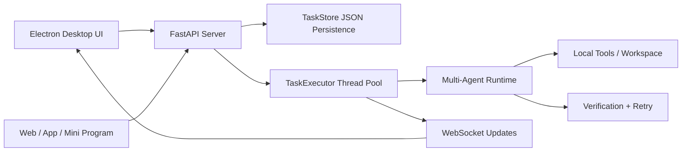

# Local Agent Workbench

[中文](#中文) | [English](#english)

---

## 中文

**本地优先的多 Agent 桌面工作台：把 Agent 从“聊天脚本”变成可观测、可接入、可异步执行的任务流服务。**

Local Agent Workbench 基于 FastAPI + Electron 构建，既可以通过桌面端操作，也可以通过标准 REST/WebSocket API 接入。它面向本地代码仓库、私有项目上下文、任务日志、结果检查和受控工具调用。

[](.)
[](.)
[](.)
[](.)

> 当前定位：本地项目工作台。联网搜索、企业 SSO、安装包、飞书/Jira/GitLab/数据库等外部系统，适合作为后续 tool/provider adapter 接入。

### 为什么做这个

很多 Agent demo 停留在对话层；这个项目把 Agent 工作抽象成可追踪的任务生命周期：

```text
create task -> validate input -> run in background -> stream status/logs -> inspect result -> persist history
```

这样 Agent 更容易接入真实产品界面：桌面端、内部工具、Web 应用、小程序或公司业务系统。

### 项目亮点

| 模块 | 已实现能力 |
|---|---|
| **桌面工作台** | Electron UI，支持工作区选择、真实设置中心、任务列表、实时日志、结果面板、Worker/任务类型控制 |
| **异步任务服务** | `POST /agent/tasks` 立即返回 `task_id`，后台线程池执行任务 |
| **可观测运行时** | 任务状态、进度、日志、结果预览、完整详情、取消任务、WebSocket 推送 |
| **多 Agent Runtime** | Manager + Deputy + 5 Workers，验证闭环、DAG Pipeline、工具权限、JSON 持久化 |
| **设置与启动稳定性** | `/agent/settings` 持久化工作区和默认任务偏好；Electron 校验后端项目目录，避免误连旧服务 |
| **工程化质量** | `runtime/` 模块化拆分，无 runtime 到 manager 的反向依赖，217 个自动化测试 |

### 架构



桌面端和外部客户端共用同一套任务 API。Agent Runtime 被放在服务端边界之后，工具、密钥、权限和日志都由后端统一控制。

### 快速启动

安装 Python 依赖：

```bash
git clone https://github.com/yangzhengke12-lgtm/local-agent-workbench.git
cd local-agent-workbench

python -m venv .venv
.venv\Scripts\activate

pip install -r requirements.txt
```

复制环境变量模板：

```bash
copy .env.example .env
```

打开 `.env`，只填写你实际使用的模型 provider。桌面端可以在没有 key 时启动，但真实 LLM 任务需要至少一个可用 provider：

```env
ANTHROPIC_API_KEY=
ANTHROPIC_BASE_URL=
DASHSCOPE_API_KEY=
MINIMAX_API_KEY=
OPENAI_API_KEY=
OPENAI_BASE_URL=
```

`.env` 已被 git 忽略，不会提交到仓库。设置页只展示 provider 是否已配置，不会保存或显示 API key 原文。

启动后端：

```bash
python server.py
```

打开：

```text
http://localhost:8000
```

启动桌面工作台：

```bash
cd desktop
npm install
npm start
```

Electron 会尽量自动启动本地 FastAPI 后端；如果 8000 端口已有后端运行，会复用现有服务。

桌面端启动时会校验 `/health` 返回的 `project_dir`。如果 8000 端口被另一个项目的旧后端占用，应用会给出明确错误，而不是误连到旧服务。

### 桌面设置中心

左下角点击「设置」或使用 `Ctrl+,` 可以打开桌面设置中心。当前真实可保存的设置包括：

- 工作区目录
- 主题颜色
- 中文 / English
- 默认任务类型
- 默认 Worker
- 左侧栏默认展开状态
- 任务列表刷新间隔

模型、Provider、Worker 工具权限、危险工具、记忆文件路径等会以只读方式展示真实运行时状态。首版不在设置页写入 API key，也不提供看起来能改但实际不生效的假开关。

### API 示例

创建异步任务：

```bash
curl -X POST http://localhost:8000/agent/tasks ^
  -H "Content-Type: application/json" ^
  -d "{\"type\":\"worker_task\",\"worker_name\":\"Sophia\",\"description\":\"Review runtime/agent_task.py for API safety issues\"}"
```

查询状态、日志和结果：

```bash
curl http://localhost:8000/agent/tasks/<task_id>
curl http://localhost:8000/agent/tasks/<task_id>/logs
curl http://localhost:8000/agent/tasks/<task_id>/result
```

完整 API 接入说明见 [agent_api.md](agent_api.md)。

如果要接入企业知识库、飞书、Jira、GitLab、数据库或内部 API，请看 [docs/integration_guide.md](docs/integration_guide.md)。

### API 接口

```text
GET    /health
GET    /agent/workspace
POST   /agent/workspace
GET    /agent/workers
GET    /agent/settings
PATCH  /agent/settings
GET    /agent/runtime
POST   /agent/tasks
GET    /agent/tasks
GET    /agent/tasks/{task_id}
GET    /agent/tasks/{task_id}/detail
GET    /agent/tasks/{task_id}/logs
GET    /agent/tasks/{task_id}/result
POST   /agent/tasks/{task_id}/cancel
WS     /ws
```

任务类型：

```text
worker_task
verified_task
project_pipeline_task
```

### 项目结构

```text
local-agent-workbench/
|-- manager.py              # Runtime facade and CLI entry
|-- server.py               # FastAPI backend + WebSocket + task API
|-- workers.json            # Agent/team configuration
|-- runtime/                # Agent runtime modules
|   |-- agent_task.py       # Task model, store, executor
|   |-- pipeline.py         # DAG pipeline execution
|   |-- tools.py            # Tool schemas and execution
|   |-- workers.py          # Worker execution
|   |-- verification.py     # Verification loop
|   `-- ...
|-- desktop/                # Electron desktop workbench
|-- tests/                  # Automated tests
|-- docs/                   # Integration notes
|-- agent_api.md            # API integration guide
`-- requirements.txt
```

### 和普通 Agent 脚本的区别

- 把 Agent 暴露成服务，而不是一个聊天循环。
- 有明确任务生命周期：`pending`, `running`, `completed`, `failed`, `cancelled`。
- 支持后台执行长任务。
- 日志和结果可以从 UI/API 检查。
- 外部系统放在 tool adapter 后面，而不是写死在 prompt 里。
- 默认 local-first，更适合私有代码仓库和内部项目上下文。

### 安全边界

已实现：

- 任务类型白名单
- Worker 白名单来自 `workers.json`
- 任务描述不能为空
- API 层不暴露任意 shell 执行入口
- runtime 工具权限按 Worker 控制

默认不包含：

- 公网联网搜索
- 生产级数据库后端
- 企业认证 / SSO
- 打包安装器
- 飞书、Jira、GitLab、SQL 等公司系统适配器

### 测试

```bash
python -m pytest -q
```

预期结果：

```text
217 passed
```

桌面端 JavaScript 语法检查：

```bash
cd desktop
node --check main.js
node --check preload.js
node --check renderer.js
node --check i18n.js
```

### License

MIT

---

## English

**A local-first multi-agent desktop workbench for turning AI agents into observable, async task workflows.**

Local Agent Workbench is a FastAPI + Electron project that lets you run a multi-agent runtime from a desktop UI or a standard REST/WebSocket API. It is built for local repositories, private project context, task logs, result inspection, and controlled tool execution.

[](.)
[](.)
[](.)
[](.)

> Current scope: local project workbench. Public web search, enterprise SSO, packaged installers, and external business systems are designed as future tool/provider adapters.

### Why This Exists

Most demo agents stop at chat. This project treats agent work as a task lifecycle:

```text
create task -> validate input -> run in background -> stream status/logs -> inspect result -> persist history
```

That makes it easier to connect agents to real product surfaces: desktop apps, internal tools, web apps, mini programs, or company workflow systems.

### Highlights

| Area | What is implemented |
|---|---|
| **Desktop workbench** | Electron UI with workspace selection, real settings center, task list, live logs, result panel, and worker/task controls |
| **Async task service** | `POST /agent/tasks` returns immediately; `TaskExecutor` runs work in a background thread pool |
| **Observable runtime** | Task status, progress, logs, result previews, full details, cancellation, and WebSocket updates |
| **Multi-agent runtime** | Manager + Deputy + 5 workers, verification loop, DAG pipeline, tool permissions, and JSON persistence |
| **Settings and startup safety** | `/agent/settings` persists workspace/default task preferences; Electron verifies backend project identity before reuse |
| **Engineering hygiene** | Modular `runtime/` package, no runtime-to-manager reverse dependency, 217 automated tests |

### How It Works


The desktop app and external clients use the same task API. The runtime stays behind the server boundary, so tools, keys, permissions, and logs remain controlled by the backend.

### Quick Start

Install Python dependencies:

```bash
git clone https://github.com/yangzhengke12-lgtm/local-agent-workbench.git
cd local-agent-workbench

python -m venv .venv
.venv\Scripts\activate

pip install -r requirements.txt
```

Copy the environment template:

```bash
copy .env.example .env
```

Open `.env` and fill only the providers you actually use. The desktop app can start without keys, but real LLM tasks require at least one configured provider:

```env
ANTHROPIC_API_KEY=
ANTHROPIC_BASE_URL=
DASHSCOPE_API_KEY=
MINIMAX_API_KEY=
OPENAI_API_KEY=
OPENAI_BASE_URL=
```

`.env` is ignored by git. The settings page only shows whether a provider is configured; it does not save or reveal API key values.

Run the backend:

```bash
python server.py
```

Open:

```text
http://localhost:8000
```

Run the desktop workbench:

```bash
cd desktop
npm install
npm start
```

The Electron app starts the local FastAPI backend automatically when possible. It also checks the `/health` `project_dir`, so it will not silently attach to a backend from a different local checkout on port 8000.

### Desktop Settings Center

Click **Settings** in the lower-left corner or press `Ctrl+,` to open the desktop settings center. The following settings are real and persisted locally:

- workspace path
- theme
- Chinese / English language
- default task type
- default worker
- default left-sidebar state
- task refresh interval

Model/provider status, worker tools, dangerous tools, and memory file paths are shown as read-only runtime facts. The first version intentionally does not write API keys from the UI and does not expose fake toggles.

### API Example

Create an async task:

```bash
curl -X POST http://localhost:8000/agent/tasks ^
  -H "Content-Type: application/json" ^
  -d "{\"type\":\"worker_task\",\"worker_name\":\"Sophia\",\"description\":\"Review runtime/agent_task.py for API safety issues\"}"
```

Poll status/logs/result:

```bash
curl http://localhost:8000/agent/tasks/<task_id>
curl http://localhost:8000/agent/tasks/<task_id>/logs
curl http://localhost:8000/agent/tasks/<task_id>/result
```

For the complete integration guide, see [agent_api.md](agent_api.md).

For business system integrations such as knowledge bases, Feishu, Jira, GitLab, databases, or internal APIs, see [docs/integration_guide.md](docs/integration_guide.md).

### API Surface

```text
GET    /health
GET    /agent/workspace
POST   /agent/workspace
GET    /agent/workers
GET    /agent/settings
PATCH  /agent/settings
GET    /agent/runtime
POST   /agent/tasks
GET    /agent/tasks
GET    /agent/tasks/{task_id}
GET    /agent/tasks/{task_id}/detail
GET    /agent/tasks/{task_id}/logs
GET    /agent/tasks/{task_id}/result
POST   /agent/tasks/{task_id}/cancel
WS     /ws
```

Task types:

```text
worker_task
verified_task
project_pipeline_task
```

### Project Structure

```text
local-agent-workbench/
|-- manager.py              # Runtime facade and CLI entry
|-- server.py               # FastAPI backend + WebSocket + task API
|-- workers.json            # Agent/team configuration
|-- runtime/                # Agent runtime modules
|   |-- agent_task.py       # Task model, store, executor
|   |-- pipeline.py         # DAG pipeline execution
|   |-- tools.py            # Tool schemas and execution
|   |-- workers.py          # Worker execution
|   |-- verification.py     # Verification loop
|   `-- ...
|-- desktop/                # Electron desktop workbench
|-- tests/                  # Automated tests
|-- docs/                   # Integration notes
|-- agent_api.md            # API integration guide
`-- requirements.txt
```

### Different From a Simple Agent Script

- Exposes agents as a service, not just a chat loop.
- Has a task lifecycle: `pending`, `running`, `completed`, `failed`, `cancelled`.
- Supports long-running work through background execution.
- Makes logs and results inspectable from UI and API.
- Keeps external integrations behind tool adapters instead of hardcoding them into prompts.
- Local-first by default, which fits private repositories and internal project context.

### Safety Boundaries

Implemented:

- task type whitelist
- worker whitelist from `workers.json`
- non-empty task descriptions
- API layer does not expose arbitrary shell execution as a public task endpoint
- runtime tool permissions are controlled per worker

Not included by default:

- public web search
- production database backend
- enterprise auth / SSO
- packaged installer
- Feishu, Jira, GitLab, SQL, or other company-system adapters

### Tests

```bash
python -m pytest -q
```

Expected:

```text
217 passed
```

Desktop JavaScript syntax check:

```bash
cd desktop
node --check main.js
node --check preload.js
node --check renderer.js
node --check i18n.js
```

### License

MIT
