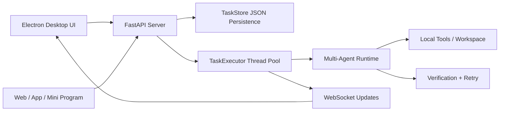

# Local Agent Workbench

**A local-first multi-agent desktop workbench for turning AI agents into observable, async task workflows.**

Local Agent Workbench is a FastAPI + Electron project that lets you run a multi-agent runtime from a desktop UI or a standard REST/WebSocket API. It is built for local repositories, private project context, task logs, result inspection, and controlled tool execution.

[](.)
[](.)
[](.)
[](.)

> Current scope: local project workbench. Public web search, enterprise SSO, packaged installers, and external business systems are designed as future tool/provider adapters.

## Why This Exists

Most demo agents stop at chat. This project treats agent work as a task lifecycle:

```text
create task -> validate input -> run in background -> stream status/logs -> inspect result -> persist history
```

That makes it easier to connect agents to real product surfaces: desktop apps, internal tools, web apps, mini programs, or company workflow systems.

## Highlights

| Area | What is implemented |
|---|---|
| **Desktop workbench** | Electron UI with workspace selection, task list, live logs, result panel, and worker/task controls |
| **Async task service** | `POST /agent/tasks` returns immediately; `TaskExecutor` runs work in a background thread pool |
| **Observable runtime** | Task status, progress, logs, result previews, full details, cancellation, and WebSocket updates |
| **Multi-agent runtime** | Manager + Deputy + 5 workers, verification loop, DAG pipeline, tool permissions, and JSON persistence |
| **Engineering hygiene** | Modular `runtime/` package, no runtime-to-manager reverse dependency, 207 automated tests |

## How It Works



The desktop app and external clients use the same task API. The runtime stays behind the server boundary, so tools, keys, permissions, and logs remain controlled by the backend.

## Quick Start

### 1. Install Python dependencies

```bash
git clone https://github.com/yangzhengke12-lgtm/local-agent-workbench.git
cd local-agent-workbench

python -m venv .venv
.venv\Scripts\activate

pip install -r requirements.txt
```

### 2. Configure model keys

Create `.env` in the project root:

```env
ANTHROPIC_API_KEY=your-anthropic-api-key
ANTHROPIC_BASE_URL=
ANTHROPIC_MODEL=deepseek-v4-pro

OPENAI_API_KEY=
OPENAI_BASE_URL=
```

Only fill the provider you use. `.env` is ignored by git.

### 3. Run the backend

```bash
python server.py
```

Open:

```text
http://localhost:8000
```

### 4. Run the desktop workbench

```bash
cd desktop
npm install
npm start
```

The Electron app starts the local FastAPI backend automatically when possible.

## API Example

Create an async task:

```bash
curl -X POST http://localhost:8000/agent/tasks ^
  -H "Content-Type: application/json" ^
  -d "{\"type\":\"worker_task\",\"worker_name\":\"Sophia\",\"description\":\"Review runtime/agent_task.py for API safety issues\"}"
```

Poll status/logs/result:

```bash
curl http://localhost:8000/agent/tasks/<task_id>
curl http://localhost:8000/agent/tasks/<task_id>/logs
curl http://localhost:8000/agent/tasks/<task_id>/result
```

For the complete integration guide, see [agent_api.md](agent_api.md).

## API Surface

```text
GET    /health
GET    /agent/workspace
POST   /agent/workspace
GET    /agent/workers
POST   /agent/tasks
GET    /agent/tasks
GET    /agent/tasks/{task_id}
GET    /agent/tasks/{task_id}/detail
GET    /agent/tasks/{task_id}/logs
GET    /agent/tasks/{task_id}/result
POST   /agent/tasks/{task_id}/cancel
WS     /ws
```

Task types:

```text
worker_task
verified_task
project_pipeline_task
```

## Project Structure

```text
local-agent-workbench/
├── manager.py              # Runtime facade and CLI entry
├── server.py               # FastAPI backend + WebSocket + task API
├── workers.json            # Agent/team configuration
├── runtime/                # Agent runtime modules
│   ├── agent_task.py       # Task model, store, executor
│   ├── pipeline.py         # DAG pipeline execution
│   ├── tools.py            # Tool schemas and execution
│   ├── workers.py          # Worker execution
│   ├── verification.py     # Verification loop
│   └── ...
├── desktop/                # Electron desktop workbench
├── tests/                  # Automated tests
├── agent_api.md            # API integration guide
└── requirements.txt
```

## What Makes It Different From a Simple Agent Script

- It exposes agents as a service, not just a chat loop.
- It has a task lifecycle: `pending`, `running`, `completed`, `failed`, `cancelled`.
- It supports long-running work through background execution.
- It makes logs and results inspectable from UI and API.
- It keeps external integrations behind tool adapters instead of hardcoding them into prompts.
- It is local-first by default, which fits private repositories and internal project context.

## Safety Boundaries

Implemented:

- task type whitelist
- worker whitelist from `workers.json`
- non-empty task descriptions
- API layer does not expose arbitrary shell execution as a public task endpoint
- runtime tool permissions are controlled per worker

Not included by default:

- public web search
- production database backend
- enterprise auth / SSO
- packaged installer
- Feishu, Jira, GitLab, SQL, or other company-system adapters

## Tests

```bash
python -m pytest -q
```

Expected:

```text
207 passed
```

Desktop JavaScript syntax check:

```bash
cd desktop
node --check main.js
node --check preload.js
node --check renderer.js
node --check i18n.js
```

## License

MIT
